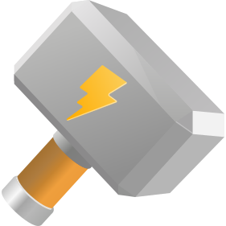

# Vike Assets

[Standard](#standard)  
[Very small](#very-small)  
[Old logo](#old-logo)  

 

## Standard

The standard Vike icon.

**vike.svg**

> [!NOTE]
> See this repository's files for variants for different contexts (padding, circle crop, etc.).

 

## Very small

Use the following to display Vike's logo at a very small size. (It has reduced handle length and increased contrast.)

**vike-favicon.svg**

 

## Old logo

**old/vike-oblique.svg**

> [!NOTE]
> See also the [old logo editor](https://land.vike.dev/editor).
