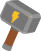

# Vike Assets

## Recommended

The standard Vike icon:

**vike.svg**

 

## Alternative

Use the following if the standard Vike icon doesn't work for you.

**vike-favicon.svg**

**old/vike-oblique.svg**

> [!NOTE]
> See also the [old logo editor](https://land.vike.dev/editor).

For more alternatives see this repository's files.
