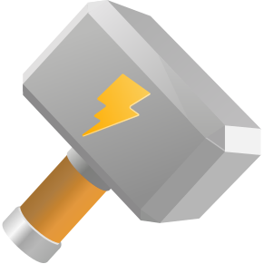
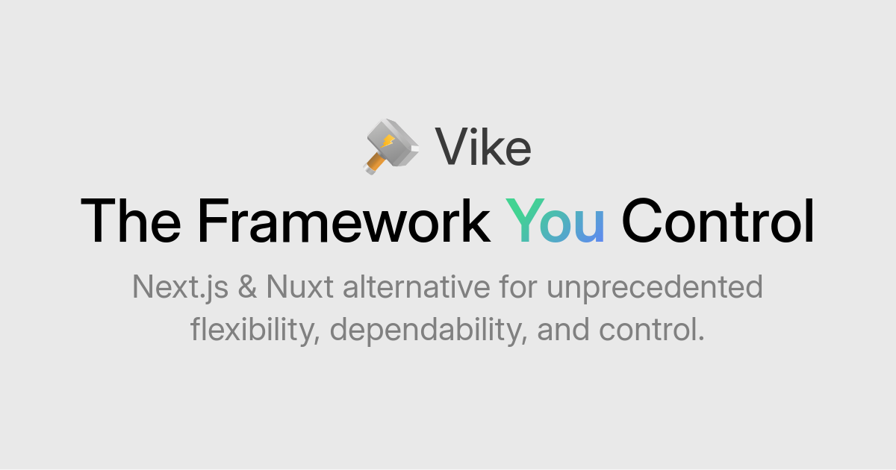

# Vike Assets

[Logo](#logo)  
[Banner](#banner)  

 

## Logo

[Standard](#standard)  
[Very small](#very-small)  
[Animated](#animated)  
[3D model](#3d-model)  
[Old logo](#old-logo)  

### Standard

The standard Vike icon.

**logo/vike.svg**

> [!NOTE]
> See this repository's files for variants for different contexts (padding, circle crop, etc.).

### Very small

Use the following to display Vike's logo at a very small size. (It has reduced handle length and increased contrast.)

**logo/favicon/vike-favicon.svg**

### Animated

[vike-nitedani-animated.webm](https://github.com/user-attachments/assets/47e06736-16ab-4e00-98b9-c61e810f144a)

See:
 - [3D model](#3d-model)
 - [Making a Video from a 3D Spline model](https://gist.github.com/brillout/73624de22e636977b7738e2946c8df9e)

### 3D model

The original 3D Spline model can be found at [GitHub > `vikejs/vike-logo-3d`](https://github.com/vikejs/vike-logo-3d).

### Old logo

**logo/old/vike-oblique.svg**

> [!NOTE]
> See also the [old logo editor](https://land.vike.dev/editor).

 

## Banner

**banner/vike-banner.png**

